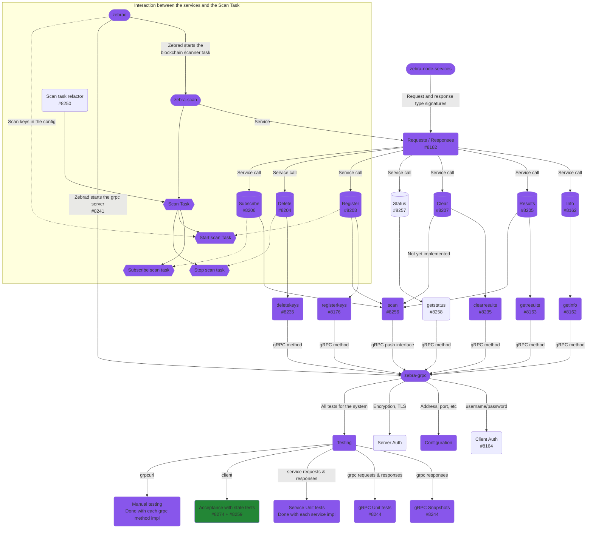
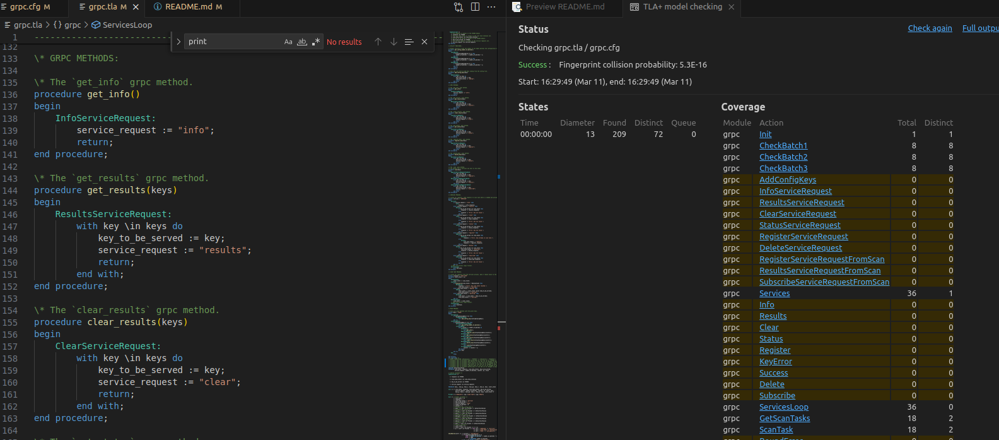
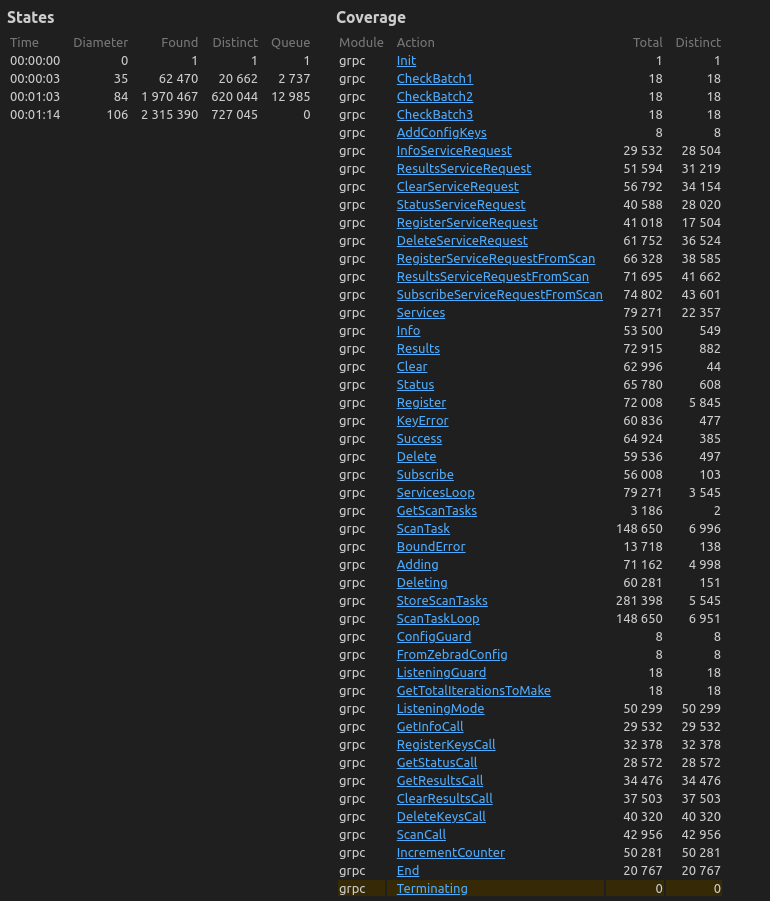

# The Zebra GRPC Scanner Spefification

## Introduction

The [Zebra](https://github.com/ZcashFoundation/zebra) project has recently developed an MVP for a gRPC interface that interacts with the `zebra-scanner` crate functionality. This document serves as a comprehensive specification for the Zebra gRPC scanner functionality. It outlines the motivation behind the development, presents the design diagram used during the design stage, and provides a formal specification of the system.

## Motivation

The motivation behind developing the Zebra gRPC scanner functionality was to enhance interoperability and accessibility to `zebra-scanner`s core features. By providing a gRPC interface, we aim to simplify integration with other systems and improve overall usability.

## Design Diagram

The design diagram (v0.6) illustrates the various components and interactions within the Zebra gRPC scanner system. It outlines the flow of requests and responses between different modules and services. Each node in the diagram represents a specific function or service, while the arrows denote the flow of data or control between them.



## Formal specification

The formal specification of the system is defined using PlusCal, which is then translated into TLA+. The goal is to model check the system using TLC, ensuring correctness and reliability.

- [PlusCal script and TLA+ translation](grpc.tla)
- [Model Constants config file](grpc.cfg)
- [Generated specification PDF](grpc.pdf)

### Usage

To perform model checking, users can utilize tools such as the TLA+ toolbox or [VS Code extension](https://marketplace.visualstudio.com/items?itemName=alygin.vscode-tlaplus). Follow these steps for VS Code extension:

1. Open the `grpc.cfg` file and specify the constants according to the desired configuration.
2. Open `grpc.tla` in the editor and execute the "TLA+: parse module" command.
3. Execute the "TLA+: Check model with TLC" command to initiate model checking. The output will be displayed in a new window.

An empty configuration will look as:

```
SPECIFICATION Spec
CONSTANT defaultInitValue = defaultInitValue
\* Add statements after this line.
CONSTANT ConfigViewingKeys = {}
CONSTANT GrpcViewingKeysBatch1 = {}
CONSTANT GrpcViewingKeysBatch2 = {}
CONSTANT GrpcViewingKeysBatch3 = {}

CONSTANT MaxScanTasks = 2
```



A much more bigger instance of the spec can be model checked with for example, the following configuration:

```
SPECIFICATION Spec
CONSTANT defaultInitValue = defaultInitValue
\* Add statements after this line.
CONSTANT ConfigViewingKeys = {"vk1", "vk2"}
CONSTANT GrpcViewingKeysBatch1 = {"vk3", "vk4", "vk5"}
CONSTANT GrpcViewingKeysBatch2 = {"vk5", "vk6"}
CONSTANT GrpcViewingKeysBatch3 = {"vk5"}

CONSTANT MaxScanTasks = 10
```



## Conclusion

The Zebra gRPC scanner specification provides a detailed overview of the system's design and functionality. While this document serves as an initial version, there are opportunities for improvement, such as adding invariants and exploring the full potential of TLA+ for verifying liveness and correctness. This project represents a step towards utilizing formal methods for ensuring the reliability of Zebra's core components.
