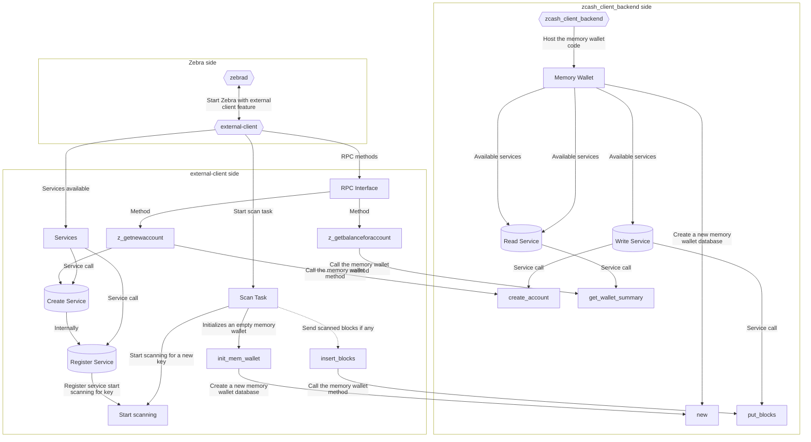

# Integration between the Zebra and the `zcash_client_backend` memory wallet interface

## Introduction

This document outlines a potential design for integrating Zebra with the `zcash_client_backend`.

The outlined design is subject to further refinement and iteration, as it represents uncharted territory with room for modifications or complete reconsideration based on input from involved design and development teams.

**This design is not a plan to develop a wallet in Zebra** but a possible path to follow to integrate `zcash_client_backend` memory wallet code with Zebra opening the possibility to develop external clients. These abstract external client might be a wallet but it is outside of the scope to plan that work here.

## Motivation

As the transition away from zcashd draws near, zebrad emerges as the natural successor. However, external client functionality, specifically the librustzcash library with the `zcash_client_backend`, must persist.

With the development of the scanning capabilities in Zebra ([learn more](grpc.md)), new opportunities for having external client support within Zebra arise. To optimize resource utilization, integrating these components rather than building something entirely new is preferred. This specification leverages components from both sides to create a bridge between them.

## Design diagram

At the core of the system lies the `zcash_client_backend`, hosting the memory wallet code. The memory wallet has services for reading, writing data, and creating a new memory wallet database.

On the Zebra side, a feature will enable external client functionality when the node gets started. If the feature is enabled, `external-client` component will be imported which exposes various RPC methods, including `z_getnewaccount`, which invokes the `create_account` in the `zcash_client_backend` crate.

The `external-client` also do the scanning, this was originally the `zebra-scan` crate of Zebra where it's name was changed to `external-client` and additional functionality (RPC interface, etc) is added.

An additional RPC method `z_getbalanceforaccount` was added to the spec for more clarity.

- `z_getnewaccount`: https://zcash.github.io/rpc/z_getnewaccount.html
- `z_getbalanceforaccount`: https://zcash.github.io/rpc/z_getbalanceforaccount.html

## Specification

This specification simulates the integration of a memory wallet with Zebra, facilitating communication among various components, including the memory wallet, Zebra, and the `zcash_client_backend` crate.

The simulation starts with a call to the `z_getnewaccount` method from the main process. Subsequent processes handle service requests, interact with the `zcash_client_backend` crate, and manage scan tasks as required.

[Client Integration Specification](client_integration.tla)
