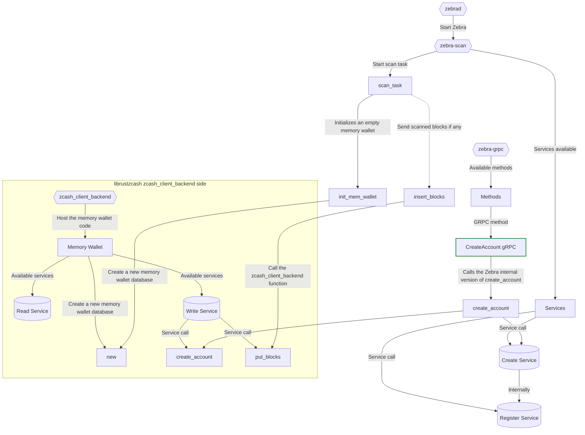

# The integration between the memory wallet and Zebra

v0.1 diagram:

```mermaid
flowchart TD
    subgraph librustzcash [librustzcash zcash_client_backend side]
        zcash_client_backend{{zcash_client_backend}} --> |Host the memory wallet code|memory_wallet[Memory Wallet]
        memory_wallet --> |Available services|read[(Read Service)]
        memory_wallet --> |Available services|write[(Write Service)]
        memory_wallet --> |Create a new memory wallet database|new
        write --> |Service call|create_account_zcash_client_backend[create_account]
        write --> |Service call|put_blocks
    end
    zebra-grpc{{zebra-grpc}} --> |Available methods|methods[Methods]
    methods --> |GRPC method|create_account_grpc[CreateAccount gRPC]
    create_account_grpc --> |Calls the Zebra internal version of create_account|create_account_zebra

    zebrad{{zebrad}} -->|Start Zebra| zebra-scan{{zebra-scan}}
    zebra-scan -->|Start scan task| scan_task
    zebra-scan -->|Services available| Services
    Services --> |Service call|Register[(Register Service)]
    Services --> |Service call|Create[(Create Service)]
    create_account_zebra[create_account] --> create_account_zcash_client_backend
    create_account_zebra --> Create
    Create --> |Internally|Register
    scan_task -.-> |Send scanned blocks if any|insert_blocks
    insert_blocks ----> |Call the zcash_client_backend function|put_blocks
    scan_task ----> |Initializes an empty memory wallet|init_mem_wallet
    init_mem_wallet ----> |Create a new memory wallet database|new

    style create_account_grpc stroke:#238636,stroke-width:2px;
```