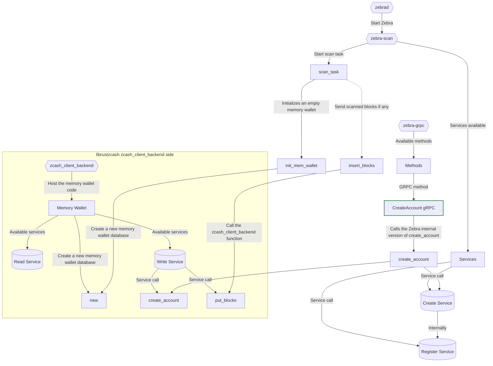

# Integration between the Memory Wallet and Zebra

## Introduction

This document outlines a potential design for integrating Zebra with the zcash_client_backend, aiming to position zebrad as a replacement for zcashd concerning wallet functionality.

The outlined design is subject to further refinement and iteration, as it represents uncharted territory with room for modifications or complete reconsideration based on input from involved design and development teams.

## Motivation

As the transition away from zcashd draws near, zebrad emerges as the natural successor. However, wallet functionality, specifically the librustzcash library with the `zcash_client_backend`, must persist.

With the development of gRPC functionality and scanning capabilities in Zebra ([learn more](grpc.md)), new opportunities for having wallet support within Zebra arise. To optimize resource utilization, integrating these components rather than building something entirely new is preferred. This specification leverages components from both sides to create a bridge between them.

## Design diagram

At the core of the system lies the `zcash_client_backend`, hosting the memory wallet code. The memory wallet has services for reading, writing data, and creating a new memory wallet database.

On the Zebra side, the `zebra-grpc` component exposes various methods, including `create_account_grpc`, which invokes the Zebra internal version of `create_account`. This internal process ultimately leads to calling `create_account` in the `zcash_client_backend` crate.

When initiated, the `zebrad` binary triggers the `zebra-scan` and `Services` processes. `zebra-scan` initializes a scan task and, if necessary, dispatches scanned blocks to `insert_blocks`, which in turn invokes the `put_blocks` function in the `zcash_client_backend` crate.

## Specification

This specification simulates the integration of a memory wallet with Zebra, facilitating communication among various components, including the memory wallet, Zebra, and the `zcash_client_backend` crate.

The simulation starts with a call to the `create_account_grpc` method from the main process. Subsequent processes handle service requests, interact with the `zcash_client_backend` crate, and manage scan tasks as required.

[Wallet Integration Specification](wallet_integration.tla)
