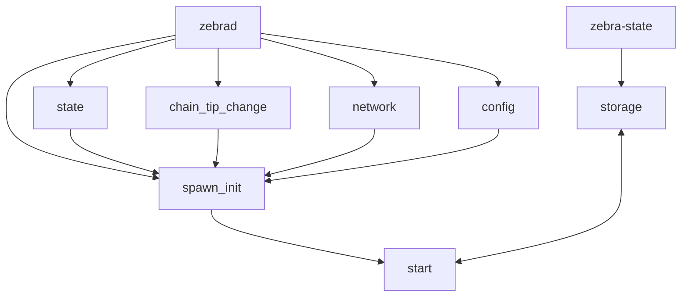
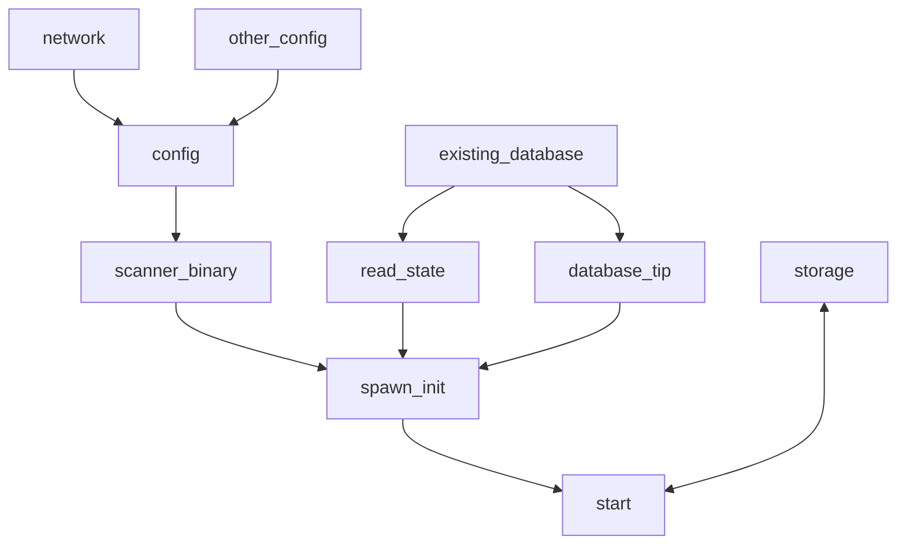

# Zebra scanner binary and process

We have the goal of decoupling zebra-scan functionality from zebra:

https://github.com/ZcashFoundation/zebra/issues/8573

## Current scanner implementation

In the current implementation the `zebrad` binary is in charge of starting the scanning task by calling `zebra_scanner::spawn_init` function. 

At the moment of starting the scan task zebrad already has available `state`, `chain_tip_change`, `network` and `config`.

The `start` function will call `storage` which is currently linked with the `zebra-state` crate.

## Target implementation

We want the scanning related tasks to be isolated, that is, there should be a `zebra-scanner` binary that is in charge of calling the never ending `spawn_init` function.

In an initial approach we are dealing only with the finalized part of the blockchain, this is blocks that are stored as permanent in the underlying RocksDB database zebra creates and updates while running. Interaction between the `zebra-scanner` binary and the data is only by the database. 

