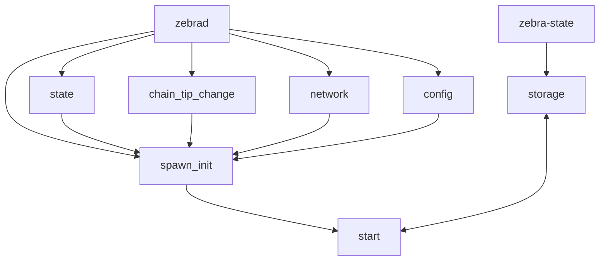
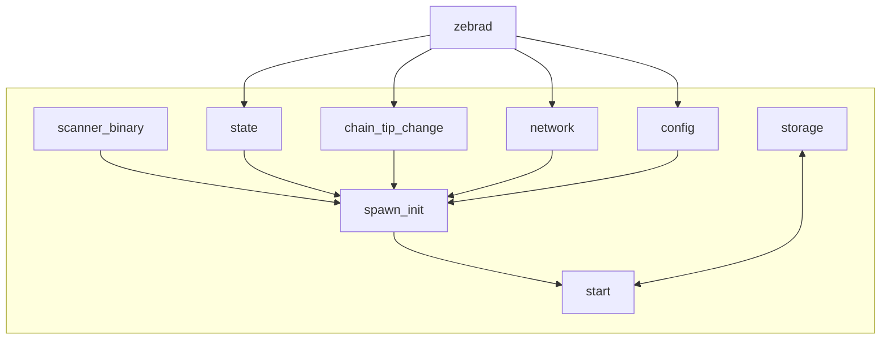

# Zebra scanner binary and process

We have the goal of decoupling zebra-scan functionality from zebra:

https://github.com/ZcashFoundation/zebra/issues/8573

## Current scanner implementation

In the current implementation the `zebrad` binary is in charge of starting the scanning task by calling `zebra_scanner::spawn_init` function. 

At the moment of starting the scan task zebrad already has available `state`, `chain_tip_change`, `network` and `config`.

The `start` function will call `storage` which is currently linked with the `zebra-state` crate.



## Target implementation

We want the scanning related tasks to be isolated, that is, there should be a `scanner-binary` that is in charge of calling the never ending `spawn_init` function.

The `spawn_init` function should get the arguments `state`, `chain_tip_change`, `network` and `config` from a zebrad instance however i am not sure if this is directly possible.




## Types involved:

- **state**:

    ```
    pub type State = Buffer<
        BoxService<zebra_state::Request, zebra_state::Response, zebra_state::BoxError>,
        zebra_state::Request,
    >;
    ```
- **chain_tip_change**:
    ```
    pub struct ChainTipChange {
        latest_chain_tip: LatestChainTip,
        last_change_hash: Option<block::Hash>,
        network: Network,
    }
    ```

    where:

    ```
    pub struct LatestChainTip {
        receiver: WatchReceiver<ChainTipData>,
    }
    ```
- **network**:

- **config**:

- **storage**:

## Possible approaches

- 
- 